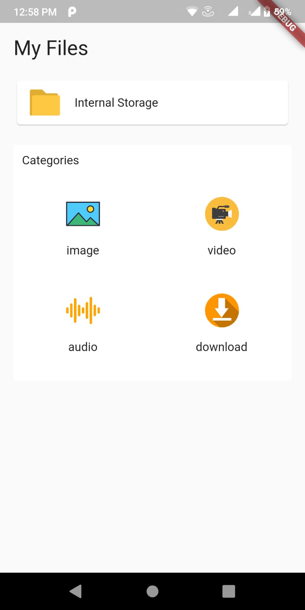
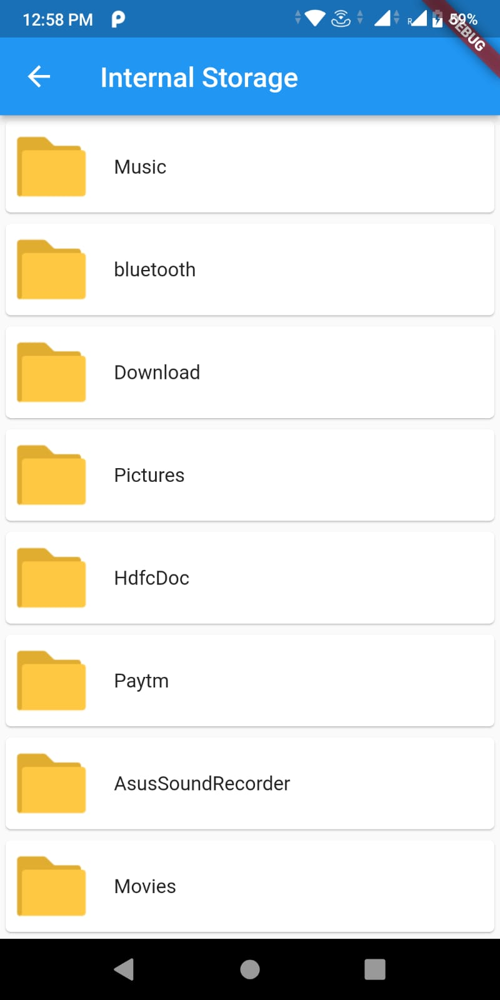
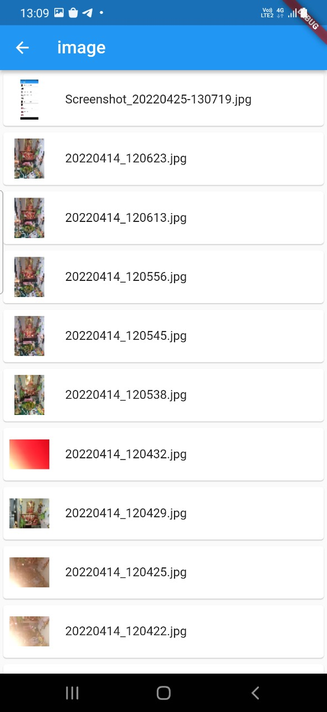
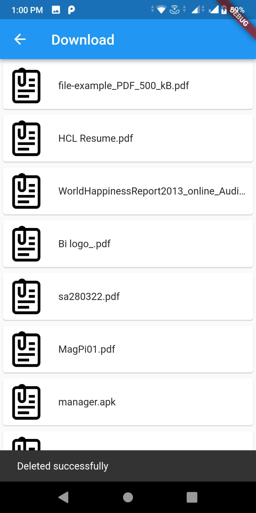
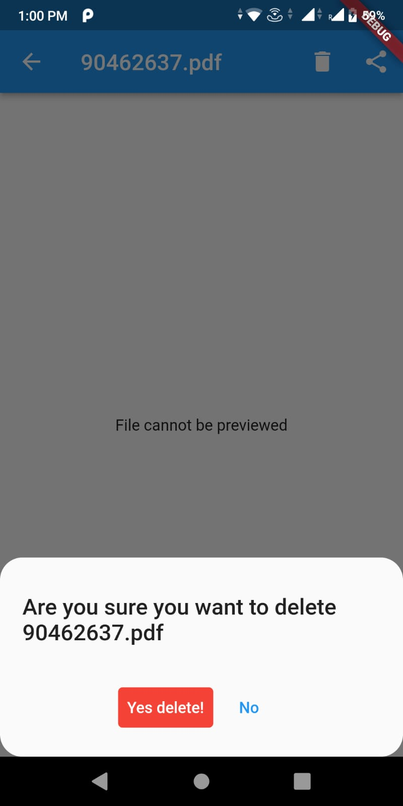
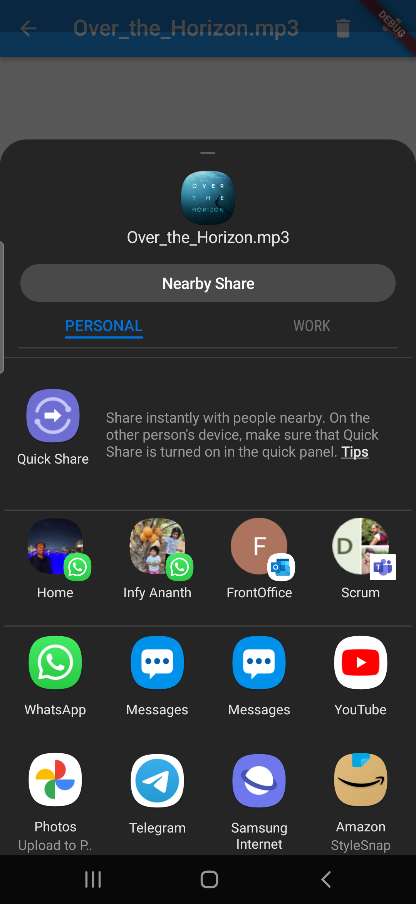

# file_app

An app to view files and folders and perform manipulations like delete and send.

 {height: 200px}
 {height: 200px}
 {height: 200px}
 {height: 200px}
 {height: 200px}
 {height: 200px}
 {height: 200px}

This app contains only android implementation as I currently don't have access to a mac machine to test out swift code.

## Major dependencies used

### bloc

For state management and dependency injection of services

### build_value, build_runner and built_collection

For maintaining models

### equatable

For bloc state and event comparisions

### video_player

For previewing of videos

## Project structure
